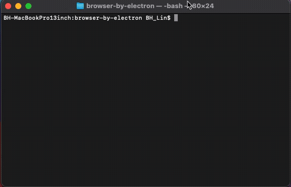
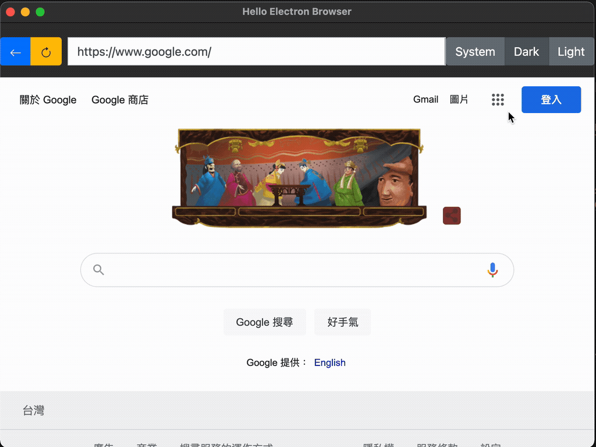

browser-by-electron
====================
This is a mini browser built by Electron.  

## Table of Contents
<!-- START doctoc generated TOC please keep comment here to allow auto update -->
<!-- DON'T EDIT THIS SECTION, INSTEAD RE-RUN doctoc TO UPDATE -->
- [browser-by-electron](#browser-by-electron)
  - [Table of Contents](#table-of-contents)
  - [How to Run the application](#how-to-run-the-application)
  - [Building Distributables](#building-distributables)
  - [Illustration](#illustration)
  - [Demo](#demo)
  - [Demo Dark Mode](#demo-dark-mode)
  - [My Custom Scheme](#my-custom-scheme)
  - [Reference:](#reference)
<!-- END doctoc generated TOC please keep comment here to allow auto update -->

## How to Run the application
```bash
cd browser-by-electron;
yarn install;
yarn start;
```

## Building Distributables
<code>
yarn make
</code>    
<br/>



## Illustration


## Demo 
[](https://youtu.be/q9jRIe3dAIk)

## Demo Dark Mode


## My Custom Scheme

1. First, you should call "registerSchemesAsPrivileged"
```javascript
protocol.registerSchemesAsPrivileged([
    { scheme: 'CUSTOM_SCHEME', privileges: { standard: true, secure: true, allowServiceWorkers: true, supportFetchAPI: true, corsEnabled: true } }
])
```
2. When the application is ready, try to register your custom scheme.
```javascript
  protocol.registerStringProtocol('CUSTOM_SCHEME', (request, callback) => {
    callback("Your response in string.");
  })
```

## Reference:   
<https://www.electronjs.org/docs/tutorial/quick-start#create-a-basic-application>  
<https://www.electronjs.org/docs/api/webview-tag>  
<https://www.electronforge.io/>  
<https://www.electronjs.org/docs/tutorial/dark-mode>  