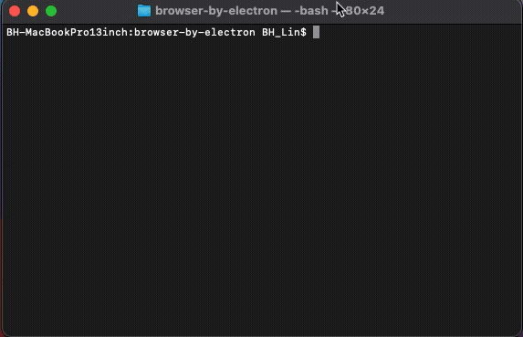

# browser-by-electron

This is a mini browser built by Electron.  
Reference:   
<https://www.electronjs.org/docs/tutorial/quick-start#create-a-basic-application>
<https://www.electronjs.org/docs/api/webview-tag>
<https://www.electronforge.io/>

## How to Run the application
```bash
cd browser-by-electron;
yarn install;
yarn start;
```

## Building Distributables
<code>
yarn make
</code>    
<br/>



## Download the application
[](./out/make/zip/darwin/x64/browser-by-electron-darwin-x64-0.0.1.zip)
[](./out/make/squirrel.windows/x64/browser-by-electron-0.0.1_Setup.exe)

## Illustration


## Demo 
[](https://youtu.be/q9jRIe3dAIk)