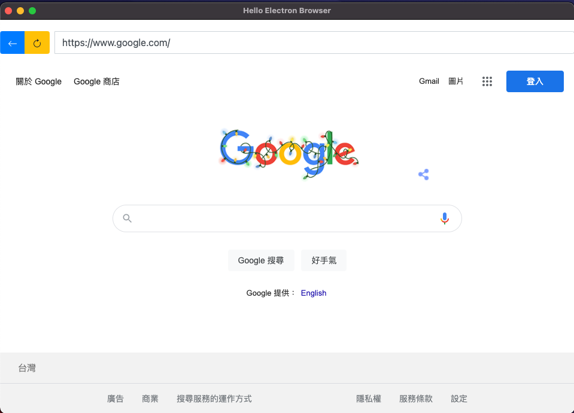
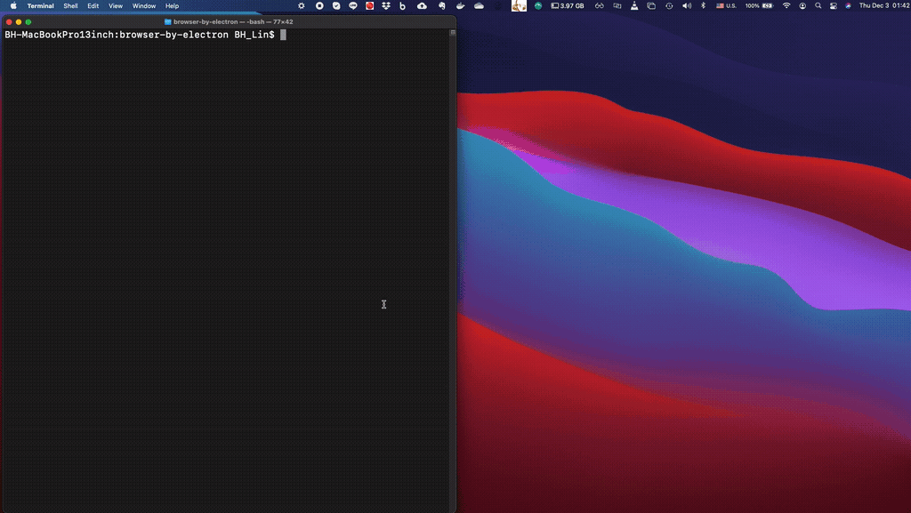

# browser-by-electron

This is a mini browser built by Electron.  
Reference:   
<https://www.electronjs.org/docs/tutorial/quick-start#create-a-basic-application>
<https://www.electronjs.org/docs/api/webview-tag>
<https://www.electronforge.io/>

## How to Run the application
<code>
cd browser-by-electron; yarn install; yarn start;     
</code>  

## Building Distributables
<code>
yarn make
</code>

## Illustration

## Demo 
