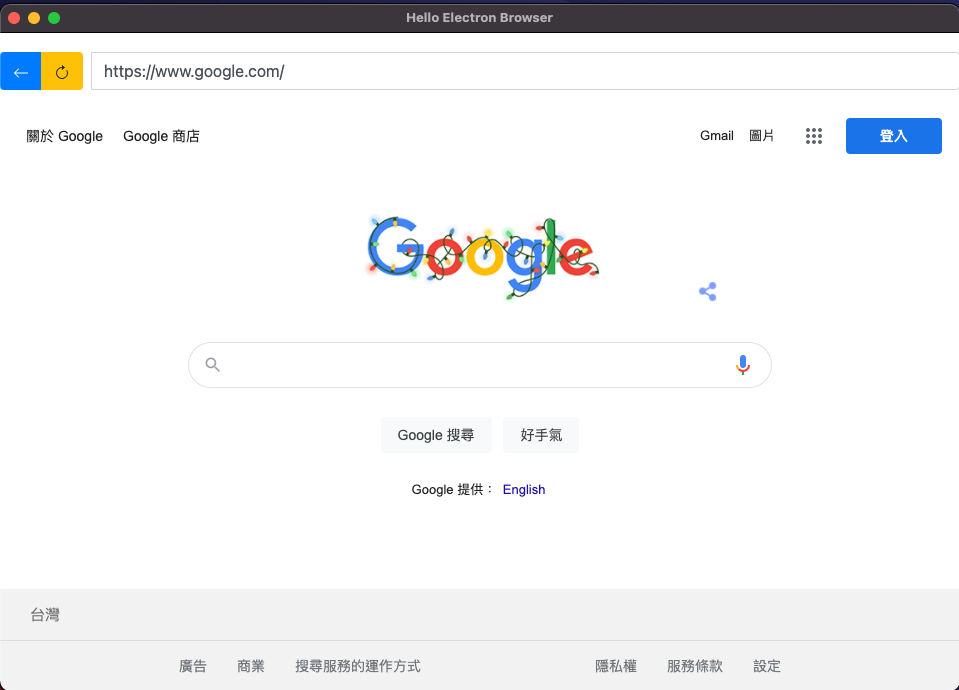
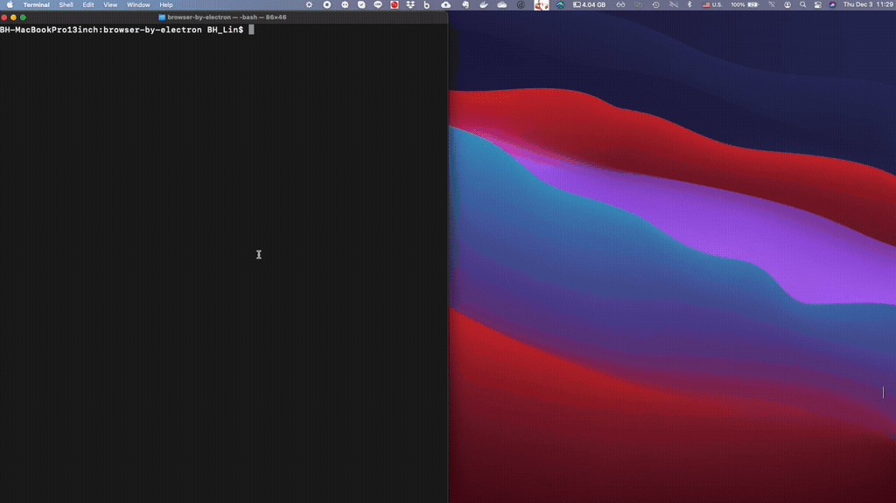

browser-by-electron
====================
This is a mini browser built by Electron. It features a simple web browser interface with navigation controls, URL input, and theme switching capabilities (light/dark/system modes).

[](https://opensource.org/licenses/MIT)
[](https://electronjs.org)  

## Table of Contents
<!-- START doctoc generated TOC please keep comment here to allow auto update -->
<!-- DON'T EDIT THIS SECTION, INSTEAD RE-RUN doctoc TO UPDATE -->
- [browser-by-electron](#browser-by-electron)
  - [Table of Contents](#table-of-contents)
  - [Features](#features)
  - [Prerequisites](#prerequisites)
  - [Installation](#installation)
  - [How to Run the application](#how-to-run-the-application)
  - [Building Distributables](#building-distributables)
  - [Project Structure](#project-structure)
  - [Illustration](#illustration)
  - [Demo](#demo)
  - [Demo Dark Mode](#demo-dark-mode)
  - [My Custom Scheme](#my-custom-scheme)
  - [Development](#development)
    - [Available Scripts](#available-scripts)
    - [Key Technologies](#key-technologies)
    - [Browser Features](#browser-features)
  - [Reference:](#reference)
<!-- END doctoc generated TOC please keep comment here to allow auto update -->

## Features

- 🌐 **Web Browser Interface**: Simple and intuitive browser with back and reload buttons
- 🎨 **Theme Support**: Switch between light, dark, and system themes
- 🔗 **URL Navigation**: Enter any URL to browse websites
- 🖥️ **Cross-platform**: Built with Electron for Windows, macOS, and Linux
- 🔧 **Custom Protocol**: Support for custom URL schemes
- 📦 **Easy Distribution**: Build distributables with Electron Forge

## Prerequisites

Before running this application, make sure you have the following installed:

- [Node.js](https://nodejs.org/) (version 12 or higher)
- [Yarn](https://yarnpkg.com/) package manager

## Installation

1. Clone the repository:
```bash
git clone https://github.com/binghuan/browser-by-electron.git
cd browser-by-electron
```

2. Install dependencies:
```bash
yarn install
```

## How to Run the application

To start the application in development mode:

```bash
cd browser-by-electron
yarn install
yarn start
```

The application will open in a new window with the browser interface.

## Building Distributables

To build the application for distribution:

```bash
yarn make
```

This will create platform-specific distributables in the `out` directory:
- **Windows**: Squirrel installer and executable
- **macOS**: ZIP archive with .app bundle
- **Linux**: DEB and RPM packages


## Project Structure

```
browser-by-electron/
├── src/
│   ├── index.html      # Main HTML file
│   ├── index.js        # Renderer process script
│   ├── index.css       # Styling
│   └── main.js         # Main process (Electron entry point)
├── resources/          # Images and demo files
├── package.json        # Project configuration and dependencies
├── icon.png           # Application icon
└── README.md          # This file
```

## Illustration


## Demo 
[](https://youtu.be/q9jRIe3dAIk)

## Demo Dark Mode


## My Custom Scheme

This application demonstrates how to implement custom URL schemes in Electron:

1. First, you should call "registerSchemesAsPrivileged" before the app is ready:
```javascript
protocol.registerSchemesAsPrivileged([
    { scheme: 'CUSTOM_SCHEME', privileges: { standard: true, secure: true, allowServiceWorkers: true, supportFetchAPI: true, corsEnabled: true } }
])
```

2. When the application is ready, register your custom scheme handler:
```javascript
protocol.registerStringProtocol('CUSTOM_SCHEME', (request, callback) => {
    callback("Your response in string.");
})
```

## Development

### Available Scripts

- `yarn start` - Start the application in development mode
- `yarn package` - Package the application without creating installers
- `yarn make` - Create distributable packages
- `yarn publish` - Publish the application (configured for your setup)

### Key Technologies

- **Electron 11.0.3** - Desktop application framework
- **Electron Forge** - Build and packaging toolchain
- **Bootstrap 4.5.3** - UI framework for styling
- **jQuery 3.5.1** - DOM manipulation and event handling

### Browser Features

The mini browser includes:
- Navigation controls (back button, reload button)
- URL input field with form validation
- Theme switching (System/Dark/Light modes)
- WebView integration for displaying web content
- IPC communication between main and renderer processes

## Reference:

- [Electron Documentation - Quick Start](https://www.electronjs.org/docs/tutorial/quick-start#create-a-basic-application)
- [Electron WebView Tag API](https://www.electronjs.org/docs/api/webview-tag)
- [Electron Forge Documentation](https://www.electronforge.io/)
- [Electron Dark Mode Implementation](https://www.electronjs.org/docs/tutorial/dark-mode)
- [Electron Protocol API](https://www.electronjs.org/docs/api/protocol)

---
